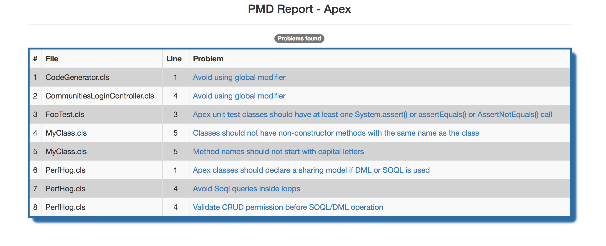
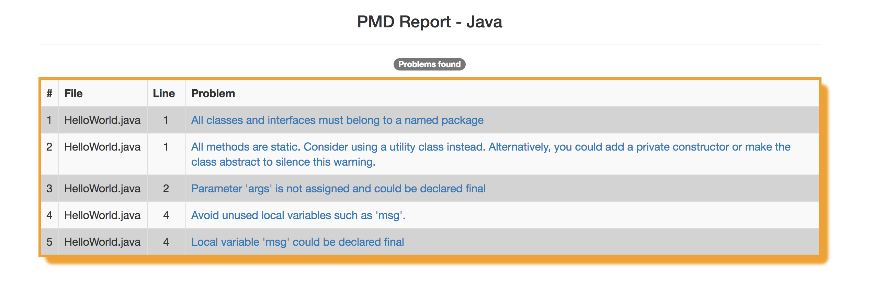
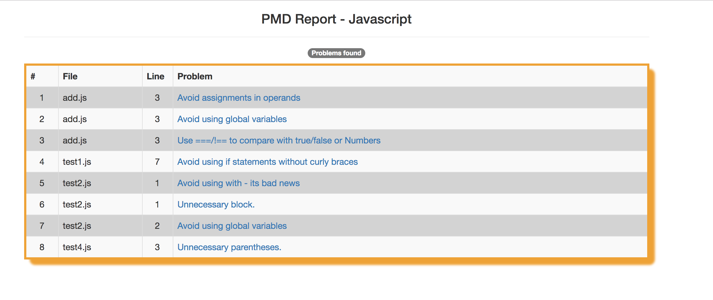

### Running PMD  using ANT tasks

What is PMD?

PMD is a source code analyzer. It finds common programming flaws like unused variables, empty catch blocks, unnecessary object creation, and so forth.


Here we cover these languages:

- Salesforce Apex
- Java
- Javascript

#### Apex
```bash
$ bash run_apex_scan_ant.sh
Buildfile: /Users/mchinnappan/code-scan-tools/pmd-dist/test-apex.xml

pmd:
      [pmd] Feb 01, 2017 7:36:35 PM apex.jorje.parser.impl.BaseApexLexer dedupe
      [pmd] INFO: Deduped array ApexLexer.DFA23_transition. Found 7927114 shorts which is 15MB not including array overhead. Removed 7204963 shorts which is 13MB not counting array overhead. Took 7ms.

BUILD SUCCESSFUL
Total time: 1 second
```


#### Java
```bash
bash run_java_scan_ant.sh
Buildfile: /Users/mchinnappan/code-scan-tools/pmd-dist/test-java.xml

pmd:

BUILD SUCCESSFUL
Total time: 1 seconds

```




#### Javascript
```bash
bash run_js_scan_ant.sh
Buildfile: /Users/mchinnappan/code-scan-tools/pmd-dist/test-js.xml

pmd:

BUILD SUCCESSFUL
Total time: 1 seconds

```



<hr/>

### How about Lightning code linting?

[Here](./LXLINT.md) it is!

Ref:
Standing on the shoulders of:

[PMD](https://pmd.github.io/)
